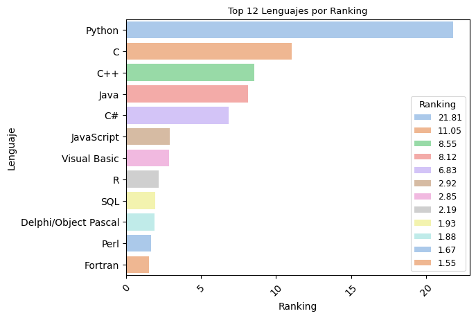
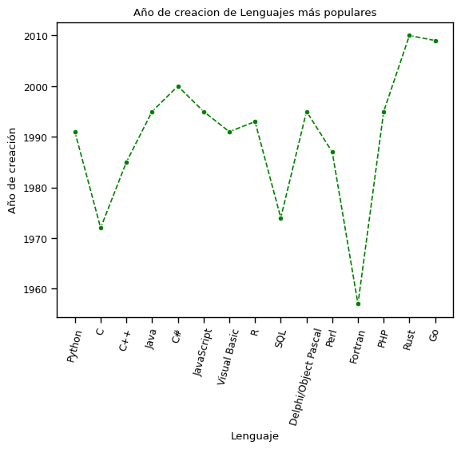
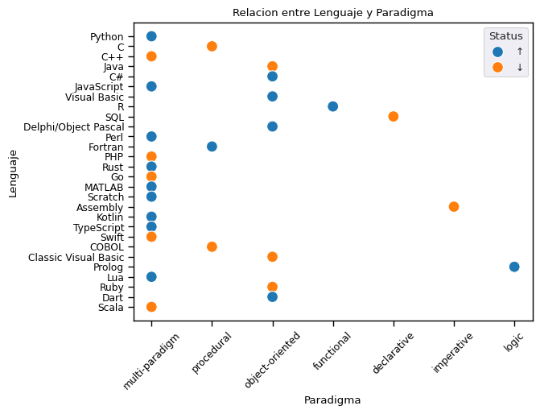

## Caracteristica de lenguajes de programación

### Lenguajes de programación son herramientas que permiten a los desarrolladores escribir instrucciones que una computadora puede entender y ejecutar. Cada lenguaje tiene sus propias características, ventajas y desventajas. A continuación, se presentan algunas características comunes de los lenguajes de programación:

## 1. Clasificacion de cinco lenguajes de programación  segun taxiomas + dato de color

### [Clasificacion de lenguajes](auxiliares/Clasificación_de_lenguajes.xlsx)
###  [ Direccion web: clasificacion de lenguajes ](https://docs.google.com/spreadsheets/d/1slIu05IXU63wQvQ27On1gVK0kN2VXIfL/edit?usp=drive_link&ouid=109136209806409698465&rtpof=true&sd=true)

## 2. Analisis de datos relacionados a los lenguajes de programación + limpieza de datos + visualización de datos mediante graficos 

Datos iniciales: [TIOBE Index](https://www.tiobe.com/tiobe-index/)
|index|Rank|Language|Rating\_Pct|Change\_Pct|Status|Paradigm|Year\_Created|Creator|Primary\_Use|Typing|
|---|---|---|---|---|---|---|---|---|---|---|
|0|1|Python|21\.81|1\.85|↑|Multi-paradigm|1991|Guido van Rossum|AI/ML, Data Science, Web|Dynamic|
|1|2|C|11\.05|-5\.41|↓|Procedural|1972|Dennis Ritchie|Systems, Embedded, OS|Static|
|2|3|C++|8\.55|-1\.72|↓|Multi-paradigm|1985|Bjarne Stroustrup|Systems, Games, HPC|Static|
|3|4|Java|8\.12|-3\.38|↓|Object-oriented|1995|James Gosling|Enterprise, Android, Web|Static|
|4|5|C\#|6\.83|0\.73|↑|Object-oriented|2000|Anders Hejlsberg|Enterprise, Games, Web|Static|
|5|6|JavaScript|2\.92|0\.1|↑|Multi-paradigm|1995|Brendan Eich|Web, Full-stack, Mobile|Dynamic|
|6|7|Visual Basic|2\.85|0\.31|↑|Object-oriented|1991|Microsoft|Enterprise, Desktop|Static|
|7|8|R|2\.19|0\.8|↑|Functional|1993|R\. Ihaka & R\. Gentleman|Statistics, Data Science|Dynamic|
|8|9|SQL|1\.93|-0\.18|↓|Declarative|1974|Donald Chamberlin|Databases, Analytics|NaN|
|9|10|Delphi/Object Pascal|1\.88|0\.42|↑|Object-oriented|1995|Anders Hejlsberg|Desktop, Enterprise|Static|
|10|11|Perl|1\.67|0\.9|↑|Multi-paradigm|1987|Larry Wall|Text Processing, Scripting|Dynamic|
|11|12|Fortran|1\.55|0\.32|↑|Procedural|1957|John Backus|Scientific, HPC|Static|
|12|13|PHP|1\.48|-0\.21|↓|Multi-paradigm|1995|Rasmus Lerdorf|Web Backend|Dynamic|
|13|14|Rust|1\.43|0\.38|↑|Multi-paradigm|2010|Graydon Hoare|Systems, WebAssembly|Static|
|14|15|Go|1\.38|-0\.36|↓|Multi-paradigm|2009|Robert Griesemer|Cloud, Microservices|Static|
|15|16|MATLAB|1\.25|0\.17|↑|Multi-paradigm|1984|Cleve Moler|Engineering, Research|Dynamic|
|16|17|Scratch|1\.18|0\.12|↑|Visual|2002|MIT Media Lab|Education|NaN|
|17|18|Assembly|1\.12|-0\.22|↓|Imperative|1949|Various|Embedded, OS Kernels|NaN|
|18|19|Kotlin|1\.08|0\.15|↑|Multi-paradigm|2011|JetBrains|Android, Server-side|Static|
|19|20|TypeScript|1\.05|0\.21|↑|Multi-paradigm|2012|Anders Hejlsberg|Web, Full-stack|Static|
|20|21|Swift|1\.02|-0\.08|↓|Multi-paradigm|2014|Apple Inc\.|iOS, macOS|Static|
|21|22|COBOL|0\.76|-0\.15|↓|Procedural|1959|Grace Hopper \(team\)|Banking, Government|Static|
|22|23|Classic Visual Basic|0\.74|-0\.05|↓|Object-oriented|1991|Microsoft|Legacy Desktop|Static|
|23|24|Prolog|0\.72|0\.1|↑|Logic|1972|Alain Colmerauer|AI, NLP|Dynamic|
|24|25|Lua|0\.68|0\.04|↑|Multi-paradigm|1993|PUC-Rio team|Games, Embedded|Dynamic|
|25|26|Ruby|0\.65|-0\.18|↓|Object-oriented|2005|Yukihiro Matsumoto|Web, Scripting|Dynamic|
|26|27|Dart|0\.62|0\.09|↑|Object-oriented|2011|Google|Mobile \(Flutter\)|Static|
|27|28|Scala|0\.58|-0\.06|↓|Multi-paradigm|2004|Martin Odersky|Big Data, Backend|Static| 
<br>

#### verificamos si hay celdas con valores nulos, si hay duplicados, luego se realiza un perfilado de los datos, y una limpieza, se verifican inconsistencias y se convierten los valore nulos a string n/a 

### Resultado:
|index|Rank|Language|Rating\_Pct|Change\_Pct|Status|Paradigm|Year\_Created|Creator|Primary\_Use|Typing|
|---|---|---|---|---|---|---|---|---|---|---|
|0|1|Python|21\.81|1\.85|↑|multi-paradigm|1991|Guido van Rossum|AI/ML, Data Science, Web|dynamic|
|1|2|C|11\.05|-5\.41|↓|procedural|1972|Dennis Ritchie|Systems, Embedded, OS|static|
|2|3|C++|8\.55|-1\.72|↓|multi-paradigm|1985|Bjarne Stroustrup|Systems, Games, HPC|static|
|3|4|Java|8\.12|-3\.38|↓|object-oriented|1995|James Gosling|Enterprise, Android, Web|static|
|4|5|C\#|6\.83|0\.73|↑|object-oriented|2000|Anders Hejlsberg|Enterprise, Games, Web|static|
|5|6|JavaScript|2\.92|0\.1|↑|multi-paradigm|1995|Brendan Eich|Web, Full-stack, Mobile|dynamic|
|6|7|Visual Basic|2\.85|0\.31|↑|object-oriented|1991|Microsoft|Enterprise, Desktop|static|
|7|8|R|2\.19|0\.8|↑|functional|1993|R\. Ihaka & R\. Gentleman|Statistics, Data Science|dynamic|
|8|9|SQL|1\.93|-0\.18|↓|declarative|1974|Donald Chamberlin|Databases, Analytics|n/a|
|9|10|Delphi/Object Pascal|1\.88|0\.42|↑|object-oriented|1995|Anders Hejlsberg|Desktop, Enterprise|static|
|10|11|Perl|1\.67|0\.9|↑|multi-paradigm|1987|Larry Wall|Text Processing, Scripting|dynamic|
|11|12|Fortran|1\.55|0\.32|↑|procedural|1957|John Backus|Scientific, HPC|static|
|12|13|PHP|1\.48|-0\.21|↓|multi-paradigm|1995|Rasmus Lerdorf|Web Backend|dynamic|
|13|14|Rust|1\.43|0\.38|↑|multi-paradigm|2010|Graydon Hoare|Systems, WebAssembly|static|
|14|15|Go|1\.38|-0\.36|↓|multi-paradigm|2009|Robert Griesemer|Cloud, Microservices|static|
|15|16|MATLAB|1\.25|0\.17|↑|multi-paradigm|1984|Cleve Moler|Engineering, Research|dynamic|
|16|17|Scratch|1\.18|0\.12|↑|multi-paradigm|2002|MIT Media Lab|Education|n/a|
|17|18|Assembly|1\.12|-0\.22|↓|imperative|1949|Various|Embedded, OS Kernels|n/a|
|18|19|Kotlin|1\.08|0\.15|↑|multi-paradigm|2011|JetBrains|Android, Server-side|static|
|19|20|TypeScript|1\.05|0\.21|↑|multi-paradigm|2012|Anders Hejlsberg|Web, Full-stack|static|
|20|21|Swift|1\.02|-0\.08|↓|multi-paradigm|2014|Apple Inc\.|iOS, macOS|static|
|21|22|COBOL|0\.76|-0\.15|↓|procedural|1959|Grace Hopper \(team\)|Banking, Government|static|
|22|23|Classic Visual Basic|0\.74|-0\.05|↓|object-oriented|1991|Microsoft|Legacy Desktop|static|
|23|24|Prolog|0\.72|0\.1|↑|logic|1972|Alain Colmerauer|AI, NLP|dynamic|
|24|25|Lua|0\.68|0\.04|↑|multi-paradigm|1993|PUC-Rio team|Games, Embedded|dynamic|
|25|26|Ruby|0\.65|-0\.18|↓|object-oriented|2005|Yukihiro Matsumoto|Web, Scripting|dynamic|
|26|27|Dart|0\.62|0\.09|↑|object-oriented|2011|Google|Mobile \(Flutter\)|static|
|27|28|Scala|0\.58|-0\.06|↓|multi-paradigm|2004|Martin Odersky|Big Data, Backend|static|
<br>

### representacion grafica de los datos obtenidos:
### Top 12 lenguajes relacion entre ranking y lenguaje.


## Relacion entre año de creacion y 15 lenguajes mas populares.


## Relacion entre Lenguajes y paradigma con status de popularidad.

## [Archivo de graficos](auxiliares/tarea_graficos.ipynb)
## [Archivo graficos colab web](https://colab.research.google.com/drive/1wM_ArWysIqf7hBn95MMzQg9lXflQ9BFu)

## 3. Solucionar un problema en diferente paradigmas.
## Paradigmas de programación

- Imperativo: paradigma central, describe cómo se hace paso a paso.

- Procedural: rama que organiza en procedimientos (ej. Pascal, COBOL).

- Orientado a Objetos: encapsulación y reutilización (ej. Java, C++).

- Funcional: funciones puras y composición (ej. Haskell, Lisp).

- Declarativo: paradigma alternativo, describe qué se hace sin detallar el cómo (ej. SQL, Prolog).


|Paradigma|Lenguaje|Enfoque|Naturaleza|
|---|---|---|---|
|Imperativo|COBOL|Paso a paso|Secuencial|
|OOP|Python|Objetos y métodos|Encapsulado|
|Funcional|Haskell|Funciones puras|Declarativo dentro del imperativo|
|Lógico|Prolog|Reglas e inferencia|Declarativo puro|

## Tabla comparativa de paradigmas 
### Criterios de comparación: valores cualitativos (ALTA, MEDIA, BAJA) para visualizar las fortalezas y debilidades de cada paradigma frente al mismo problema
- Claridad y legibilidad del código
  - ¿El código es fácil de leer y entender?
  - ¿La estructura refleja bien el paradigma?
- Nivel de abstracción
  - Procedural: funciones y estructuras básicas.
  - Orientado a objetos: clases, encapsulación, herencia.
  - Funcional: inmutabilidad, funciones puras, composición.
  - Lógico: hechos y reglas, consultas declarativas.
- Eficiencia y rendimiento
  - ¿Cómo maneja memoria y tiempo de ejecución?
  - ¿El paradigma facilita optimizaciones?
- Facilidad de mantenimiento y escalabilidad
  - ¿Es sencillo agregar nuevas funcionalidades?
  - ¿El paradigma favorece modularidad o reutilización?
- Expresividad y concisión
  - ¿Cuánto código se necesita para expresar la solución?
  - ¿El paradigma permite expresar la lógica de manera directa?


| |Imperativo (COBOL) <br> Lenguaje clásico de negocios | OOP (Python) <br> Lenguaje moderno y versátil | Funcional (Haskell <br> Lenguaje académico y matemático) | Lógico (Prolog) <br> Lenguaje declarativo de inferencia|
|---|---|---|---|---|
|Claridad y legibilidad|MEDIA|ALTA|MEDIA|MEDIA|
|Nivel de abstracción|BAJA|MEDIA-ALTA|ALTA|ALTA|
|Eficiencia y rendimiento|MEDIA|ALTA|ALTA|MEDIA|
|Facilidad de mantenimiento|BAJA|ALTA|MEDIA|MEDIA|
|Expresividad y concisión|BAJA|ALTA|MEDIA|MEDIA|


## [Ejemplos en distintos lenguajes](auxiliares/multiparadigmas.ipynb)
## [Ejemplos en distintos lenguajes web](https://drive.google.com/file/d/1xHD2jZqTkbskAKBPgjoTo197Dj1qEd7t/view?usp=sharing)

## 4. Identificar la gramatica del IF en los distintos lenguajes proporcionados reescribiendo las producciones desde el axioma hasta la sentencia IF.

## Gramática del IF en distintos lenguajes
  - Sintaxis para Java, Python, Kotlin, C++, Go, C

### Java
- CompilationUnit
  - └── TypeDeclaration
    - └── ClassDeclaration
      - └── ClassBody
        - └── ClassBodyDeclaration
          - └── MethodDeclaration
            - └── MethodBody
              - └── Block
                - └── BlockStatement
                  - └── Statement
                    -   ├── IfThenStatement
                      -        └── if ( Expression ) Statement
                    -   │
                    -   └── IfThenElseStatement
                      -        └── if ( Expression ) StatementNoShortIf else Statement

CompilationUnit       →  TypeDeclaration

TypeDeclaration       →  ClassDeclaration

ClassDeclaration      →  ClassBody

ClassBody             →  ClassBodyDeclaration

ClassBodyDeclaration  →  MethodDeclaration

MethodDeclaration     →  MethodBody

MethodBody            →  Block

Block                 →  BlockStatement

BlockStatement        →  Statement

Statement             →  IfThenStatement
                      |  IfThenElseStatement

IfThenStatement       →  if ( Expression ) Statement

IfThenElseStatement   →  if ( Expression ) StatementNoShortIf else Statement

### Python
file              →  statements ENDMARKER

statements        →  statement+

statement         →  compound_stmt
                  |  simple_stmts

compound_stmt     →  if_stmt
                  |  function_def
                  |  class_def
                  |  with_stmt
                  |  for_stmt
                  |  try_stmt
                  |  while_stmt
                  |  match_stmt

if_stmt           →  'if' named_expression ':' block elif_stmt
                  |  'if' named_expression ':' block [else_block]

block             →  NEWLINE INDENT statements DEDENT
                  |  simple_stmts

elif_stmt         →  'elif' named_expression ':' block elif_stmt
                  |  'elif' named_expression ':' block [else_block]

else_block        →  'else' ':' block

### Kotlin
kotlinFile            →  topLevelObject*

topLevelObject        →  declaration

declaration           →  functionDeclaration
                      |  classDeclaration
                      |  propertyDeclaration
                      |  typeAlias
                      |  objectDeclaration

functionDeclaration   →  'fun' simpleIdentifier functionValueParameters ':' type functionBody

functionBody          →  block
                      |  '=' expression

block                 →  '{' statements '}'

statements            →  statement*

statement             →  expression
                      |  declaration
                      |  assignment

expression            →  primaryExpression

primaryExpression     →  ifExpression
                      |  parenthesizedExpression
                      |  simpleIdentifier
                      |  literalConstant
                      |  stringLiteral
                      |  callableReference
                      |  functionLiteral
                      |  objectLiteral
                      |  collectionLiteral
                      |  thisExpression
                      |  superExpression
                      |  whenExpression
                      |  tryExpression
                      |  jumpExpression

ifExpression          →  'if' '(' expression ')' controlStructureBody
                      |  'if' '(' expression ')' [controlStructureBody] [';'] 'else' (controlStructureBody | ';')
                      |  'if' '(' expression ')' ';'

controlStructureBody  →  block
                      |  statement

### C++
translation-unit      →  declaration-seq

declaration-seq       →  declaration
                      |  declaration-seq declaration

declaration           →  function-definition
                      |  block-declaration
                      |  template-declaration
                      |  explicit-instantiation
                      |  explicit-specialization
                      |  linkage-specification
                      |  namespace-definition

function-definition   →  [decl-specifier-seq] declarator function-body

function-body         →  compound-statement

compound-statement    →  { [statement-seq] }

statement-seq         →  statement
                      |  statement-seq statement

statement             →  labeled-statement
                      |  expression-statement
                      |  compound-statement
                      |  selection-statement
                      |  iteration-statement
                      |  jump-statement
                      |  declaration-statement
                      |  try-block

selection-statement   →  if ( condition ) statement
                      |  if ( condition ) statement else statement
                      |  switch ( condition ) statement

condition             →  expression
                      |  type-specifier-seq declarator = assignment-expression

### Go
SourceFile      →  PackageClause ";" { ImportDecl ";" } { TopLevelDecl ";" } .

TopLevelDecl    →  Declaration
                |  FunctionDecl
                |  MethodDecl .

FunctionDecl    →  "func" FunctionName Signature [ FunctionBody ] .

FunctionBody    →  Block .

Block           →  "{" StatementList "}" .

StatementList   →  { Statement ";" } .

Statement       →  Declaration
                |  LabeledStmt
                |  SimpleStmt
                |  GoStmt
                |  ReturnStmt
                |  BreakStmt
                |  ContinueStmt
                |  GotoStmt
                |  FallthroughStmt
                |  Block
                |  IfStmt
                |  SwitchStmt
                |  SelectStmt
                |  ForStmt
                |  DeferStmt .

IfStmt          →  "if" [ SimpleStmt ";" ] Expression Block
                   [ "else" ( IfStmt | Block ) ] .


### C
translation-unit       →  {external-declaration}*

external-declaration   →  function-definition
                          |  declaration

function-definition    →  {declaration-specifier}* declarator
                             {declaration}* compound-statement

compound-statement     →  { {declaration}* {statement}* }

statement              →  labeled-statement
                          |  expression-statement
                          |  compound-statement
                          |  selection-statement
                          |  iteration-statement
                          |  jump-statement

selection-statement    →  if ( expression ) statement
                           |  if ( expression ) statement else statement
                           |  switch ( expression ) statement

## 5. Tabla de comparacion entre GIC, BNF, EBNF y ABNF del lenguaje BRA.
PP presenta un LP que se denomina BRA. <br>
Es un lenguaje muy simple que está diseñado, específicamente, para poseer un LP concreto sobre el que se pueda analizar la construcción de un compilador básico. <br>
Informalmente se define de esta manera: <br>
El único tipo de datos es entero <br>
Todos los identificadores son declarados implícitamente y con una longitud máxima de 4 caracteres. <br>
Los identificadores deben comenzar con una letra y están compuestos de letras, dígitos y guiones bajos. <br>
No puede terminar con guión tampoco tener dos guiones seguidos. <br>
Las constantes son secuencias de dígitos (números enteros). <br>
Hay dos tipos de sentencias: <br>
Asignación: <br>
$~~~~~~~~~~~~~~~~~$ ID ::= Expressão; <br>
$~~~~~~~~~~~~~~~~~$ Expressão es infija y se construye con identificadores, constantes y los operadores + y -; <br>
$~~~~~~~~~~~~~~~~~$ los paréntesis están permitidos <br>
Entrada/Salida: <br>
$~~~~~~~~~~~~~~~~~$ ler(lista de IDs); <br>
$~~~~~~~~~~~~~~~~~$ escrever(lista de Expressões); <br>
Cada sentencia termina con un "punto y coma" (;) <br>
El cuerpo de un programa está delimitado por começo e final <br>
começo, final, ler, escrever son palabras reservadas y deben escribirse en minúsculas <br>

El siguiente es un programa fuente en BRA:<br>
**começo** <br>
$~~~~~~~~$ ler(a,b); <br>
$~~~~~~~~$ cc ::= a + (b - 2); <br>
$~~~~~~~~$ escrever(cc, a+4); <br>
**final** <br>


GIC

```text
<programa>        ::= começo <sentencias> final

<sentencias>      ::= <sentencia>
                   | <sentencias> <sentencia>

<sentencia>       ::= <identificador> ::= <Expressão> ;
                   | ler ( <identificadores> ) ;
                   | escrever ( <Expressões> ) ;

<identificadores> ::= <identificador>
                   | <identificadores> , <identificador>

<Expressões>      ::= <Expressão>
                   | <Expressões> , <Expressão>

<Expressão>       ::= <primaria>
                   | <Expressão> <operadorAditivo> <primaria>

<primaria>        ::= <identificador>
                   | <constante>
                   | ( <Expressão> )

<identificador>   ::= <letra>
                   | <letra> <alfaNum>
                   | <letra> <alfaNum> <alfaNum>
                   | <letra> <alfaNum> <alfaNum> <alfaNum>
                   | <letra> _ <alfaNum>
                   | <letra> _ <alfaNum> <alfaNum>
                   | <letra> <alfaNum> _ <alfaNum>

<constante>       ::= <digito>
                   | <constante> <digito>

<alfaNum>         ::= <letra>
                   | <digito>

<letra>           ::= a | ... | z
                   | A | ... | Z

<digito>          ::= 0 | ... | 9

<operadorAditivo> ::= + | -
```

BNF

```text
<programa>        ::= começo <sentencias> final

<sentencias>      ::= <sentencia>
                   | <sentencias> <sentencia>

<sentencia>       ::= <identificador> ::= <Expressão> ;
                   | ler ( <identificadores> ) ;
                   | escrever ( <Expressões> ) ;

<identificadores> ::= <identificador>
                   | <identificadores> , <identificador>

<Expressões>      ::= <Expressão>
                   | <Expressões> , <Expressão>

<Expressão>       ::= <primaria>
                   | <Expressão> <operadorAditivo> <primaria>

<primaria>          ::= <identificador>
                   | <constante>
                   | ( <Expressão> )

<identificador>   ::= <letra>
                   | <letra> <alfaNum>
                   | <letra> <alfaNum> <alfaNum>
                   | <letra> <alfaNum> <alfaNum> <alfaNum>
                   | <letra> _ <alfaNum>
                   | <letra> _ <alfaNum> <alfaNum>
                   | <letra> <alfaNum> _ <alfaNum>

<constante>       ::= <digito>
                   | <digito> <constante>

<alfaNum>         ::= <letra>
                   | <digito>

<letra>           ::= a | ... | z
                   | A | ... | Z

<digito>          ::= 0 | ... | 9

<operadorAditivo> ::= + | -
```

EBNF

```text
<programa>        ::= começo <sentencias> final

<sentencias>      ::= {<sentencia>}+

<sentencia>       ::= <identificador> ::= <Expressão> ;
                   | ler ( <identificadores> ) ;
                   | escrever ( <Expressões> ) ;

<identificadores> ::= <identificador> {(, <identificador>)}*

<Expressões>      ::= <Expressão> {(, <Expressão>)}*

<Expressão>       ::= <primaria> {( <operadorAditivo> <primaria> )}*

<primaria>        ::= <identificador>
                   | <constante>
                   | ( <Expressão> )

<identificador>   ::= <letra>
                   | <letra> <alfaNum>
                   | <letra> <alfaNum> <alfaNum>
                   | <letra> <alfaNum> <alfaNum> <alfaNum>
                   | <letra> _ <alfaNum>
                   | <letra> _ <alfaNum> <alfaNum>
                   | <letra> <alfaNum> _ <alfaNum>

<constante>       ::= {<digito>}+

<alfaNum>         ::= <letra> | <digito>

<letra>           ::= a | ... | z | A | ... | Z

<digito>          ::= 0 | ... | 9

<operadorAditivo> ::= + | -
```

ABNF <br>

programa : **começo** $sentencias$  **final** <br>
$sentencias$ : $sentencia$ { $sentencia$ } <br>
$sentencia$ :  uno de <br>
$~~~~~~~~~~~~~~~~~$ $identificador$ **::=** $Expressão$ ; <br> 
$~~~~~~~~~~~~~~~~~$ ler($identificadores$) ; <br>
$~~~~~~~~~~~~~~~~~$ escrever($Expressões$) ; <br>
$identificadores$ :  $identificador$ {,  $identificador$ } <br>
$Expressões$ :  $Expressão$ {,  $Expressão$ } <br>
$Expressão$ :  $primaria$ { $operadorAditivo$ $primaria$} <br>
$primaria$ : uno de <br>
$~~~~~~~~~~~~~~~~$ $identificador$ <br>
$~~~~~~~~~~~~~~~~$ $constante$ <br>
$~~~~~~~~~~~~~~~~$ ( $Expressão$ ) <br>
$identificador$ : uno de <br>
$~~~~~~~~~~~~~~~~~~~~~~~~~$ $letra$ <br>
$~~~~~~~~~~~~~~~~~~~~~~~~~$ $letra$ $alfaNum$ <br>
$~~~~~~~~~~~~~~~~~~~~~~~~~$ $letra$ $alfaNum$ $alfaNum$ <br>
$~~~~~~~~~~~~~~~~~~~~~~~~~$ $letra$ $alfaNum$ $alfaNum$ $alfaNum$ <br>
$~~~~~~~~~~~~~~~~~~~~~~~~~$ $letra$ _ $alfaNum$ <br>
$~~~~~~~~~~~~~~~~~~~~~~~~~$ $letra$ _ $alfaNum$ $alfaNum$ <br>
$~~~~~~~~~~~~~~~~~~~~~~~~~$ $letra$ $alfaNum$ _ $alfaNum$ <br>
$constante$ : digito { digito } <br>
$alfaNum$ : uno de   <br>
$~~~~~~~~~~~~~~~~~~$ $letra$ <br>
$~~~~~~~~~~~~~~~~~~$ $digito$ <br>
$letra$ : una de **a...z A...Z** <br>
$digito$ : uno de **0...9** <br>
$operadorAditivo$ : uno de **+ -** <br>


## 6. Mapa conceptual sobre control de flujos. 


## [Mapa control de flujo](auxiliares/Mapa_flujo_de_control.jpg)
## [Direccion web: mapa control de flujo](https://drive.google.com/file/d/1OjgloaKD4cvaadUkNaeojfSGjLu3E_r0/view?usp=drive_link)