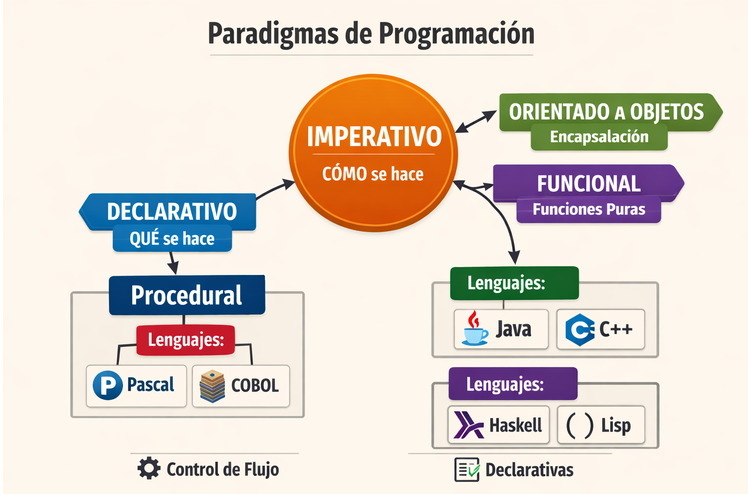
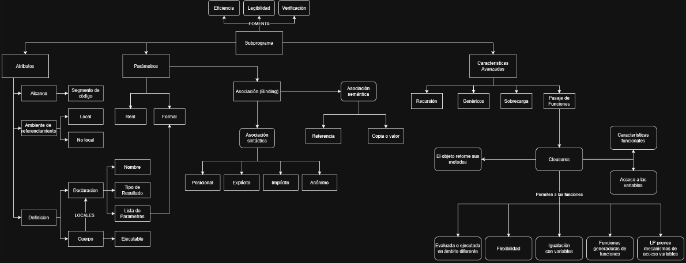

# Caracteristica de lenguajes de programación

## Lenguajes de programación son herramientas que permiten a los desarrolladores escribir instrucciones que una computadora puede entender y ejecutar. Cada lenguaje tiene sus propias características, ventajas y desventajas. A continuación, se presentan algunas características comunes de los lenguajes de programación:

## 1. Clasificacion de cinco lenguajes de programación  segun taxiomas + dato de color

## [Clasificacion de lenguajes](auxiliares/Clasificación_de_lenguajes.xlsx)

## 2. Analisis de datos relacionados a los lenguajes de programación + limpieza de datos + visualización de datos mediante graficos 
## [Archivo de graficos](auxiliares/tarea_graficos.ipynb)
## direeccion colab web: https://colab.research.google.com/drive/1wM_ArWysIqf7hBn95MMzQg9lXflQ9BFu

## 3. Solucionar un problema en diferente paradigmas.
## Paradigmas de programación

- Imperativo: paradigma central, describe cómo se hace paso a paso.

- Procedural: rama que organiza en procedimientos (ej. Pascal, COBOL).

- Orientado a Objetos: encapsulación y reutilización (ej. Java, C++).

- Funcional: funciones puras y composición (ej. Haskell, Lisp).

- Declarativo: paradigma alternativo, describe qué se hace sin detallar el cómo (ej. SQL, Prolog).

|Paradigma|Lenguaje|Enfoque|Naturaleza|
|---|---|---|---|
|Imperativo|COBOL|Paso a paso|Secuencial|
|OOP|Python|Objetos y métodos|Encapsulado|
|Funcional|Haskell|Funciones puras|Declarativo dentro del imperativo|
|Lógico|Prolog|Reglas e inferencia|Declarativo puro|

## Tabla comparativa de paradigmas 
### Criterios de comparación: valores cualitativos (ALTA, MEDIA, BAJA) para visualizar las fortalezas y debilidades de cada paradigma frente al mismo problema
- Claridad y legibilidad del código
  - ¿El código es fácil de leer y entender?
  - ¿La estructura refleja bien el paradigma?
- Nivel de abstracción
  - Procedural: funciones y estructuras básicas.
  - Orientado a objetos: clases, encapsulación, herencia.
  - Funcional: inmutabilidad, funciones puras, composición.
  - Lógico: hechos y reglas, consultas declarativas.
- Eficiencia y rendimiento
  - ¿Cómo maneja memoria y tiempo de ejecución?
  - ¿El paradigma facilita optimizaciones?
- Facilidad de mantenimiento y escalabilidad
  - ¿Es sencillo agregar nuevas funcionalidades?
  - ¿El paradigma favorece modularidad o reutilización?
- Expresividad y concisión
  - ¿Cuánto código se necesita para expresar la solución?
  - ¿El paradigma permite expresar la lógica de manera directa?

| |Imperativo (COBOL)   Lenguaje clásico de negocios | OOP (Python)   Lenguaje moderno y versátil | Funcional (Haskell   Lenguaje académico y matemático) | Lógico (Prolog)   Lenguaje declarativo de inferencia|
|---|---|---|---|---|
|Claridad y legibilidad|MEDIA|ALTA|MEDIA|MEDIA|
|Nivel de abstracción|BAJA|MEDIA-ALTA|ALTA|ALTA|
|Eficiencia y rendimiento|MEDIA|ALTA|ALTA|MEDIA|
|Facilidad de mantenimiento|BAJA|ALTA|MEDIA|MEDIA|
|Expresividad y concisión|BAJA|ALTA|MEDIA|MEDIA|

## [Ejemplos en distintos lenguajes](auxiliares/multiparadigmas.ipynb)

## 4. Identificar la gramatica del IF en los distintos lenguajes proporcionados reescribiendo las producciones desde el axioma hasta los terminales.

desde el axioma hasta el IF, y llevarlo un nivel hacia abajo, por el camino mas corto.

## Gramática del IF en distintos lenguajes
  - Sintaxis para Java, Python, Kotlin, C++, Go, C

### Java
- CompilationUnit
  - └── TypeDeclaration
    - └── ClassDeclaration
      - └── ClassBody
        - └── ClassBodyDeclaration
          - └── MethodDeclaration
            - └── MethodBody
              - └── Block
                - └── BlockStatement
                  - └── Statement
                    -   ├── IfThenStatement
                      -        └── if ( Expression ) Statement
                    -   │
                    -   └── IfThenElseStatement
                      -        └── if ( Expression ) StatementNoShortIf else Statement

CompilationUnit       →  TypeDeclaration

TypeDeclaration       →  ClassDeclaration

ClassDeclaration      →  ClassBody

ClassBody             →  ClassBodyDeclaration

ClassBodyDeclaration  →  MethodDeclaration

MethodDeclaration     →  MethodBody

MethodBody            →  Block

Block                 →  BlockStatement

BlockStatement        →  Statement

Statement             →  IfThenStatement
                      |  IfThenElseStatement

IfThenStatement       →  if ( Expression ) Statement

IfThenElseStatement   →  if ( Expression ) StatementNoShortIf else Statement

### Python
file              →  statements ENDMARKER

statements        →  statement+

statement         →  compound_stmt
                  |  simple_stmts

compound_stmt     →  if_stmt
                  |  function_def
                  |  class_def
                  |  with_stmt
                  |  for_stmt
                  |  try_stmt
                  |  while_stmt
                  |  match_stmt

if_stmt           →  'if' named_expression ':' block elif_stmt
                  |  'if' named_expression ':' block [else_block]

block             →  NEWLINE INDENT statements DEDENT
                  |  simple_stmts

elif_stmt         →  'elif' named_expression ':' block elif_stmt
                  |  'elif' named_expression ':' block [else_block]

else_block        →  'else' ':' block

### Kotlin
kotlinFile            →  topLevelObject*

topLevelObject        →  declaration

declaration           →  functionDeclaration
                      |  classDeclaration
                      |  propertyDeclaration
                      |  typeAlias
                      |  objectDeclaration

functionDeclaration   →  'fun' simpleIdentifier functionValueParameters ':' type functionBody

functionBody          →  block
                      |  '=' expression

block                 →  '{' statements '}'

statements            →  statement*

statement             →  expression
                      |  declaration
                      |  assignment

expression            →  primaryExpression

primaryExpression     →  ifExpression
                      |  parenthesizedExpression
                      |  simpleIdentifier
                      |  literalConstant
                      |  stringLiteral
                      |  callableReference
                      |  functionLiteral
                      |  objectLiteral
                      |  collectionLiteral
                      |  thisExpression
                      |  superExpression
                      |  whenExpression
                      |  tryExpression
                      |  jumpExpression

ifExpression          →  'if' '(' expression ')' controlStructureBody
                      |  'if' '(' expression ')' [controlStructureBody] [';'] 'else' (controlStructureBody | ';')
                      |  'if' '(' expression ')' ';'

controlStructureBody  →  block
                      |  statement

### C++
translation-unit      →  declaration-seq

declaration-seq       →  declaration
                      |  declaration-seq declaration

declaration           →  function-definition
                      |  block-declaration
                      |  template-declaration
                      |  explicit-instantiation
                      |  explicit-specialization
                      |  linkage-specification
                      |  namespace-definition

function-definition   →  [decl-specifier-seq] declarator function-body

function-body         →  compound-statement

compound-statement    →  { [statement-seq] }

statement-seq         →  statement
                      |  statement-seq statement

statement             →  labeled-statement
                      |  expression-statement
                      |  compound-statement
                      |  selection-statement
                      |  iteration-statement
                      |  jump-statement
                      |  declaration-statement
                      |  try-block

selection-statement   →  if ( condition ) statement
                      |  if ( condition ) statement else statement
                      |  switch ( condition ) statement

condition             →  expression
                      |  type-specifier-seq declarator = assignment-expression

### Go
SourceFile      →  PackageClause ";" { ImportDecl ";" } { TopLevelDecl ";" } .

TopLevelDecl    →  Declaration
                |  FunctionDecl
                |  MethodDecl .

FunctionDecl    →  "func" FunctionName Signature [ FunctionBody ] .

FunctionBody    →  Block .

Block           →  "{" StatementList "}" .

StatementList   →  { Statement ";" } .

Statement       →  Declaration
                |  LabeledStmt
                |  SimpleStmt
                |  GoStmt
                |  ReturnStmt
                |  BreakStmt
                |  ContinueStmt
                |  GotoStmt
                |  FallthroughStmt
                |  Block
                |  IfStmt
                |  SwitchStmt
                |  SelectStmt
                |  ForStmt
                |  DeferStmt .

IfStmt          →  "if" [ SimpleStmt ";" ] Expression Block
                   [ "else" ( IfStmt | Block ) ] .

### C
translation-unit       →  {external-declaration}*

external-declaration   →  function-definition
                          |  declaration

function-definition    →  {declaration-specifier}* declarator
                             {declaration}* compound-statement

compound-statement     →  { {declaration}* {statement}* }

statement              →  labeled-statement
                          |  expression-statement
                          |  compound-statement
                          |  selection-statement
                          |  iteration-statement
                          |  jump-statement

selection-statement    →  if ( expression ) statement
                           |  if ( expression ) statement else statement
                           |  switch ( expression ) statement

## 5. Tabla de comparacion entre GIC, BNF, EBNF y ABNF del lenguaje BRA.
PP presenta un LP que se denomina BRA. Es un lenguaje muy simple que está diseñado, específicamente, para poseer un LP concreto sobre el que se pueda analizar la construcción de un compilador básico. Informalmente se define de esta manera:
El único tipo de datos es entero
Todos los identificadores son declarados implícitamente y con una longitud máxima de 4 caracteres
Los identificadores deben comenzar con una letra y están compuestos de letras, dígitos y guiones bajos. No puede terminar con guión tampoco tener dos guiones seguidos
Las constantes son secuencias de dígitos (números enteros)
Hay dos tipos de sentencias:
Asignación:
ID ::= Expressão;
Expressão es infija y se construye con identificadores, constantes y los operadores + y -; los paréntesis están permitidos
Entrada/Salida:
ler(lista de IDs);
escrever(lista de Expressões);
Cada sentencia termina con un "punto y coma" (;)
El cuerpo de un programa está delimitado por começo e final
começo, final, ler, escrever son palabras reservadas y deben escribirse en minúsculas
El siguiente es un programa fuente en BRA:
começo
	ler(a,b);
	cc ::= a + (b - 2);
	escrever(cc, a+4);
final

ABNF  
programa : **começo** $sentencias$  **final**  
$sentencias$ : $sentencia$ { $sentencia$ }  
$sentencia$ :  uno de  
$~~~~~~~~~~~~~~~~~$ $identificador$ **::=** $Expressão$ ;   
$~~~~~~~~~~~~~~~~~$ ler($identificadores$) ;  
$~~~~~~~~~~~~~~~~~$ escrever($Expressões$) ;  
$identificadores$ :  $identificador$ {,  $identificador$ }  
$Expressões$ :  $Expressão$ {,  $Expressão$ }  
$Expressão$ :  $primaria$ { $operadorAditivo$ $primaria$}  
$primaria$ : uno de  
$~~~~~~~~~~~~~~~~$ $identificador$  
$~~~~~~~~~~~~~~~~$ $constante$  
$~~~~~~~~~~~~~~~~$ ( $Expressão$ )  
$identificador$ : uno de  
$~~~~~~~~~~~~~~~~~~~~~~~~~$ $letra$  
$~~~~~~~~~~~~~~~~~~~~~~~~~$ $letra$ $alfaNum$  
$~~~~~~~~~~~~~~~~~~~~~~~~~$ $letra$ $alfaNum$ $alfaNum$  
$~~~~~~~~~~~~~~~~~~~~~~~~~$ $letra$ $alfaNum$ $alfaNum$ $alfaNum$  
$~~~~~~~~~~~~~~~~~~~~~~~~~$ $letra$ _ $alfaNum$  
$~~~~~~~~~~~~~~~~~~~~~~~~~$ $letra$ _ $alfaNum$ $alfaNum$  
$~~~~~~~~~~~~~~~~~~~~~~~~~$ $letra$ $alfaNum$ _ $alfaNum$  
$constante$ : digito { digito }  
$alfaNum$ : uno de $letra$ $digito$  
$letra$ : una de **a-z A-Z**  
$digito$ : uno de **0-9**  
$operadorAditivo$ : uno de **+ -**  

## 6. Mapa conceptual sobre control de flujos. 

## [Mapa flujo de control](auxiliares/Mapa_flujo_de_control.jpg)